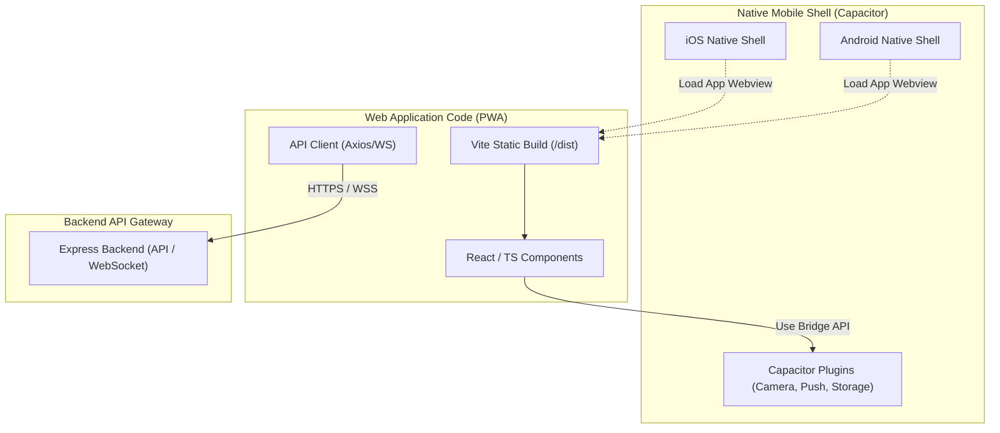

# 한일 결혼 매칭 서비스 규제 준수 및 아동/스캠 방지 보안 가이드라인

본 문서는 **korea aimasu** 서비스의 한일 양국 법적 규제 준수 의무, AI eKYC(안면 대조) 및 개인정보 암호화 보안 표준, 그리고 향후 모바일 하이브리드 앱 확장을 위한 Capacitor 아키텍처 방향성을 정의하는 공식 운영 가이드라인입니다.

---

## ⚖️ 1. 한일 양국 법적 규제 준수 가이드라인

### A. 대한민국: '결혼중개업의 관리에 관한 법률' 준수
1. **미성년자 가입 제한 (법 제10조의2)**
   * **기준**: 만 19세 미만의 미성년자는 서비스 이용이 원천적으로 불가능합니다.
   * **차단 기술**: 회원 가입 및 본인 확인 단계에서 생년월일을 검증하며, 실명/본인인증 API를 통해 연령 조건을 검사합니다.
2. **신원 검증 및 허위 정보 금지 (법 제12조)**
   * **요구사항**: 플랫폼은 회원의 신원 정보를 신뢰성 있게 검증할 의무가 있습니다.
   * **구현**: 사용자는 여권/주민등록증(신분 확인), 혼인관계증명서(싱글 확인), 재직증명서(직업 확인) 등을 업로드하여 관리자의 승인을 얻어야만 매칭 서비스의 주요 액션을 수행할 수 있습니다.
3. **개인정보 및 서류 보존 의무**
   * 분쟁 발생 시 사후 증빙을 위해 신원 서류 원본 이미지와 텍스트 로그를 암호화된 상태로 영구(혹은 회원 탈퇴 시까지 법적 기준 준수하여) 안전하게 보존합니다.

### B. 일본: '인터넷 이성 소개 사업 이용 규제법' 준수
1. **미성년자 가입 제한 (일본 법률 제18조)**
   * **기준**: 만 18세 미만의 아동/청소년은 이성 소개 사업 서비스를 이용할 수 없습니다.
   * **차단 기술**: 가입 시 연령 증명 서류(여권, 주민등록증, 운전면허증 등)를 받아 연령 조건을 반드시 확인해야 합니다.
2. **인터넷 이성 소개 사업 개시 신고**
   * 서비스 오픈 전, 관할 경찰서를 경유하여 공안위원회에 '인터넷 이성 소개 사업 개시 신고서(インターネット異性紹介事業開始届出書)'를 제출하여 승인번호를 획득하고 서비스 화면 하단에 상시 명시해야 합니다.
3. **아동 성매매 및 아동 학대 방지 의무**
   * 앱 내 메시지, 프로필에 대한 유해성 검사를 실시간으로 진행하여 아동 성매매 권유, 원조교제 문맥이 발견되는 즉시 계정을 차단(Circuit Breaker BAN)해야 합니다.

### C. 공통: 로맨스 스캠 및 사기 방지 가이드라인
* **사기 방지 경고**: 매칭 성공 후 1:1 보이스톡 연결 화면 및 첫 채팅방 진입 시 **"금전 요구, 비트코인 투자 권유, 메신저 외부 이동 요구는 로맨스 스캠(사기)일 가능성이 높으니 즉시 신고바랍니다."**라는 경고 배너를 일본어/한국어로 상시 노출합니다.
* **스캠 원클릭 신고**: 대화 화면 내 우측 상단에 24시간 상시 작동하는 '로맨스 스캠 신고/차단' 버튼을 탑재하여 즉각 격리 처리가 가능하게 합니다.

---

## 🔒 2. 개인정보 보호 및 데이터 암호화 보안 표준

### A. 민감 개인정보 양방향 암호화 (AES-256-CBC)
데이터베이스 해킹 등 최악의 정보 유출 시나리오에 대응하기 위해, 여권번호, 주민등록번호 등 핵심 고유식별정보는 데이터베이스에 **AES-256-CBC** 알고리즘으로 양방향 암호화하여 보관합니다.
* **암호화 알고리즘**: AES-256-CBC (PKCS7 Padding)
* **보안키 관리**: 암호화에 사용되는 32바이트 Key와 16바이트 IV(Init Vector)는 소스코드 내에 하드코딩하지 않고, 환경 변수(`COMPLIANCE_CRYPTO_KEY`, `COMPLIANCE_CRYPTO_IV`)로 주입받아 격리 운영합니다.

### B. 신분증 원본 이미지 스토리지 격리 (Signed URL)
* **비공개 버킷 통제**: 사용자가 제출한 신분증 및 증명서 원본 이미지 파일은 외부 접근이 완전 차단된 비공개 AWS S3 / Firebase Storage 버킷에 업로드합니다.
* **한시적 권한 위임**: 관리자나 eKYC 모듈이 해당 파일을 조회해야 할 때만, 서버에서 한시적으로 유효한 **5분 제한 임시 서명 URL(Signed URL)**을 동적으로 생성하여 접근 권한을 임시 위임하고 자동 파기되도록 합니다.

### C. PCI-DSS 준수를 위한 결제 보안 통제
* **카드정보 저장 금지**: 플랫폼 백엔드 서버(DB 포함)에는 사용자의 신용카드 번호, CVC, 비밀번호를 **어떠한 형태(암호화 포함)로도 절대 저장하거나 중개하지 않습니다.**
* **PG사 API 직접 바인딩**: 결제 대행사(Stripe 등)의 웹/앱 클라이언트 SDK를 활용하여 카드 번호 입력 단계를 PG사 도메인 수준에서 처리하며, 백엔드는 오직 결제 토큰(`PaymentMethod ID`)과 결제 성공 여부 웹훅(Webhook)만을 수신해 정합성을 보증합니다.

---

## 📱 3. PWA-to-Native Capacitor 확장 아키텍처 전략

현재 웹 기술 스택(React, Vite, TypeScript)으로 고속 빌드된 Web App(PWA) 구조를 보존하면서 모바일 네이티브 스토어(App Store, Google Play Store)로 빠르고 안전하게 전환하기 위해 **Capacitor** 프레임워크를 기반으로 아키텍처를 점진 확장합니다.

### A. Capacitor 확장 아키텍처 다이어그램

### B. 단계별 모바일 네이티브 이식 로드맵
1. **1단계: 모바일 친화적 반응형 UI 고도화**
   * 모바일 웹 브라우저 및 하이브리드 웹뷰에서 터치 반응성, 스크롤링 물리 동작이 자연스럽도록 CSS 뷰포트(`h-screen` 대신 `svh` 등) 정비.
2. **2단계: Capacitor 초기화 및 패키징**
   * 프로젝트 루트에 `@capacitor/core` 및 `@capacitor/cli` 라이브러리를 설치합니다.
   * `npx cap init [AppName] [AppId] --web-dir=dist`를 통해 `capacitor.config.json`을 활성화하고 웹 빌드 경로를 연결합니다.
3. **3단계: Android / iOS 플랫폼 빌드 통합**
   * `@capacitor/android` 및 `@capacitor/ios` 플랫폼 의존성을 추가하고 각각의 네이티브 프로젝트 폴더를 생성합니다 (`npx cap add android`, `npx cap add ios`).
   * 웹 코드 빌드 후 `npx cap sync` 명령어를 통해 네이티브 프로젝트 내부의 자산을 동기화하고 Xcode/Android Studio로 전격 컴파일합니다.
4. **4단계: 네이티브 브릿지 API 장착**
   * 셀카 촬영을 위한 `@capacitor/camera` 및 푸시 알림 수신을 위한 `@capacitor/push-notifications` 등 플러그인을 탑재하여 웹 런타임 내에서 모바일 하드웨어 자원을 직접 호출합니다.
